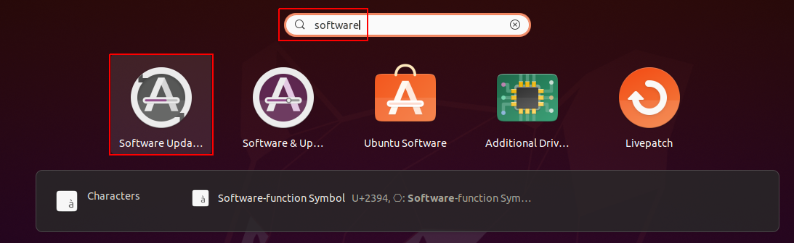
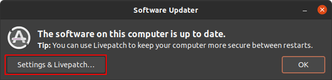

# Development Machine Setup

## About
This document contains valuable information on dockerized CARLA / TensorFlow setups.
All instructions are tested for Ubuntu 20.04 with a NVIDIA RTX 3060 GPU, but should also
work for pretty much any other GPU supported by NVIDIA Docker and TensorFlow's Docker images.

*If you haven't tried already, we can tell you that multi-component NVIDIA GPU setups with
CUDA, TensorFlow, CARLA, etc. are extremely fragile and it's a total nightmare finding
out the right versions that fit together.
NVIDIA Docker simplifies those kind of setups by a lot and most importantly makes the
development environment significantly more stable for various hardware setups, allowing
developers with different machines to work together seemlessly.*

## Update the System
First, we just update all apt packages of your system, so everything is up-to-date.

```sh
sudo apt-get update && sudo apt-get upgrade -y
```

*Note: Don't skip this even if installing a 100% fresh Ubuntu image. It seems hilarious,
but those images don't come with the latest packages installed, even if you picked
"install latest updates" in the Ubuntu installation dialog, so you need to update
the packages first.*

## Install NVIDIA Driver
Now, we pick a NVIDIA driver for our CARLA simulations and AI trainings.
Ubuntu already offers us an easy option to run a driver setup for installing
proprietary NVIDIA drivers that are compatible with NVIDIA Docker, TensorFlow GPU
and the CARLA simulation.

Unfortunately, there's no way to set up NVIDIA drivers safely from the CLI, so some clicks
in the Ubuntu UI will be required. Don't try out scripted approaches, most of them break your
system and cause lots of tears. We can tell you from our own experience.

1) Press the Windows key and type software


2) Select the UI app for updating Ubuntu packages


3) Navigate to the "Additional Drivers" tab and select a proprietary NVIDIA driver (here it's version 470 for desktop PCs)


4) Once the setup is done, restart your PC, so the GPU driver changes apply

*Note: Don't waste any time thinking about using the open-source driver, it's not working!!!*

## Install Docker with NVIDIA GPU Support
Next, we install Docker for building images and launching containers
(care, the second command reboots your system).

```sh
# install cURL, Docker and Docker-Compose
sudo apt-get update && sudo apt-get install -y curl docker.io docker-compose

# register the NVIDIA Docker PPA as apt source
distribution=$(. /etc/os-release;echo $ID$VERSION_ID) \
    && curl -s -L https://nvidia.github.io/nvidia-docker/gpgkey | sudo apt-key add - \
    && curl -s -L https://nvidia.github.io/nvidia-docker/$distribution/nvidia-docker.list \
        | sudo tee /etc/apt/sources.list.d/nvidia-docker.list

# install NVIDIA Docker from the official NVIDIA PPA
sudo apt-get update && sudo apt-get install -y nvidia-docker2

# allow non-root users to work with Docker (requires a reboot)
sudo usermod -aG docker $USER && reboot
```

If you're not familiar with Docker commands, check out the official docs:
- Docker: https://docs.docker.com/engine/reference/commandline/docker/
- Docker-Compose: https://docs.docker.com/compose/compose-file/compose-file-v2/

See the [official NVIDIA docs](https://docs.nvidia.com/datacenter/cloud-native/container-toolkit/install-guide.html#setting-up-nvidia-container-toolkit)
for further information on NVIDIA Docker.

## Run the CARLA Simulation with Docker
According to a [GitHub post](https://github.com/carla-simulator/carla/issues/3164), running a
CARLA simulation can be done like this using NVIDIA Docker:

```sh
# launch a bash terminal session to a CARLA 0.9.10.1 environment (version used for this seminar)
docker run -it --gpus all \
    -e DISPLAY=$DISPLAY --net=host --runtime=nvidia \
    carlasim/carla:0.9.10.1 /bin/bash CarlaUE4.sh -opengl
```

*Note: There is [official documentation](https://carla.readthedocs.io/en/latest/build_docker/)
for simulating CARLA 0.9.10 - 0.9.12 with Docker, so check those out as well.*

## Install an IDE of Choice

### Run JupyterHub with Tensorflow GPU Support
JupyterHub is a really nice solution to run Jupyter notebooks and quickly hack some Python AI.
Gladly, TensorFlow officially provides their Docker image with all tools pre-installed,
making devs like us a lot more productive.

Following command launches a Docker container serving the JupyterHub website on port 8888:

```sh
# launch a JupyterHub server with GPU support
docker run -it --rm -v $(realpath ~/notebooks):/tf/notebooks -p 8888:8888 \
    --runtime=nvidia  --gpus all \
    tensorflow/tensorflow:latest-gpu-jupyter

# open the signup link that gets printed to the console and open it in your browser
# now, you're good to go and can train TensorFlow AIs with GPU support
```

*Note: VSCode can attach to JupyterHub servers, so you can code in VSCode, see this
[blog post](https://blog.jupyter.org/connect-to-a-jupyterhub-from-visual-studio-code-ed7ed3a31bcb).*

### Visual Studio Code
Visual Studio Code offers great flexibility and lightweight code editing for various programming
languages. Some of its many upsides are the easy setup, proper Linux bash scripting and
Docker support.

As already mentioned the setup is extremely easy (see the snap command below) and only takes
several minutes. Installing extensions can be automated as well, making the annyoing IDE setup
procedure 100% scriptable.

Following command installs the VSCode editor:

```sh
sudo snap install code --classic
```

Recommended VSCode extensions are:

| Extension                   | Description                                                                 |
| --------------------------- | --------------------------------------------------------------------------- |
| cpptools                    | Sets up useful CMake tools for compiling, testing, debugging, etc.          |
| ms-python.python            | Sets up useful Python tools for debugging, linting, running notebooks, etc. |
| ms-azuretools.vscode-docker | Sets up useful Docker tools for managing images / containers via UI         |
| Gruntfuggly.todo-tree       | Searches for TODO stubs in the code and lists them                          |

## Final Notes and Remarks
We hope this setup did work for you like a charm.
If not, please let us know, so we can figure out a solution for you.
